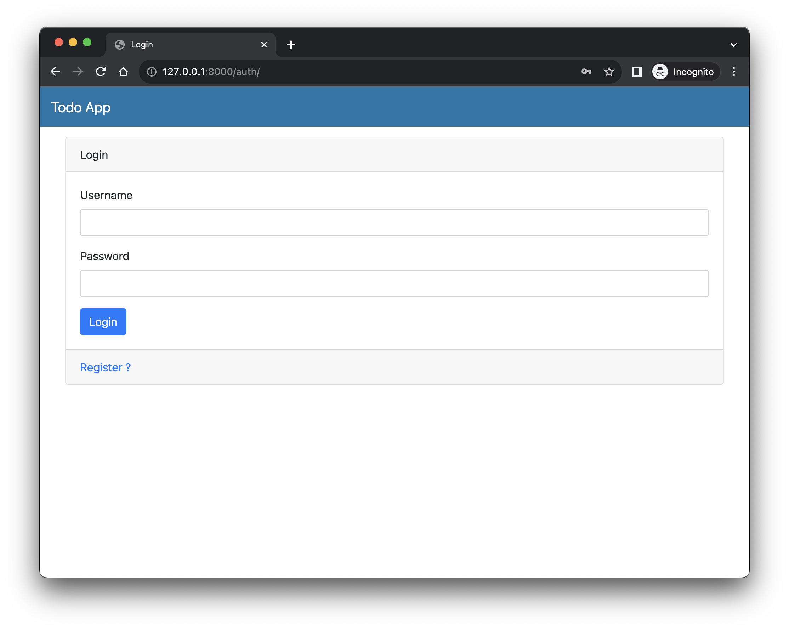
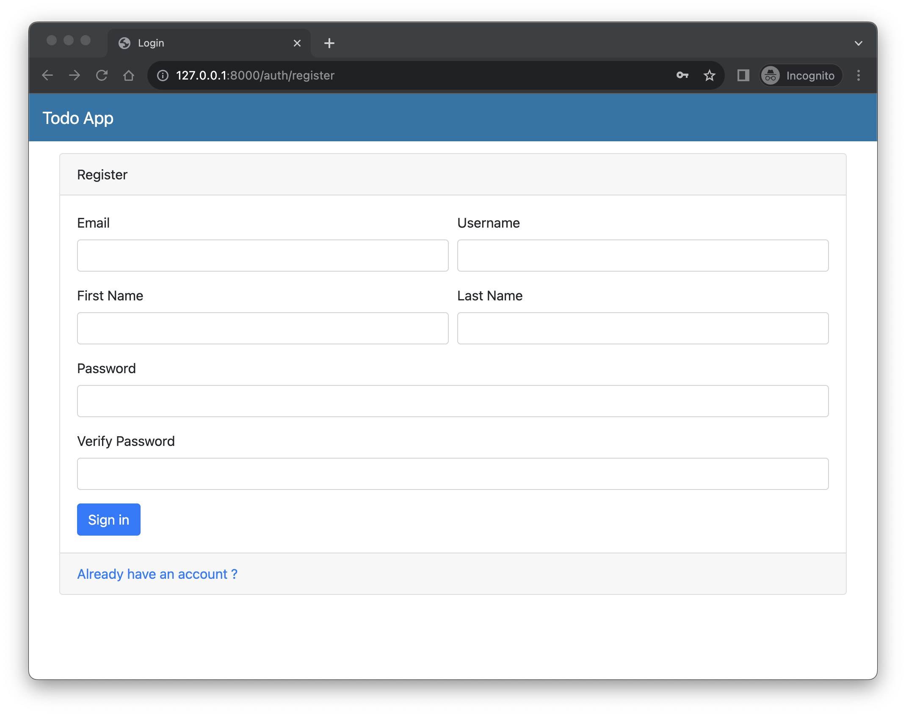
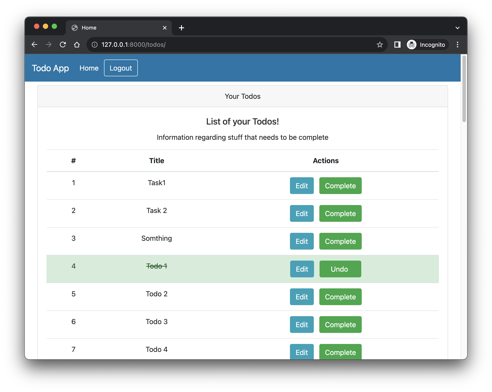
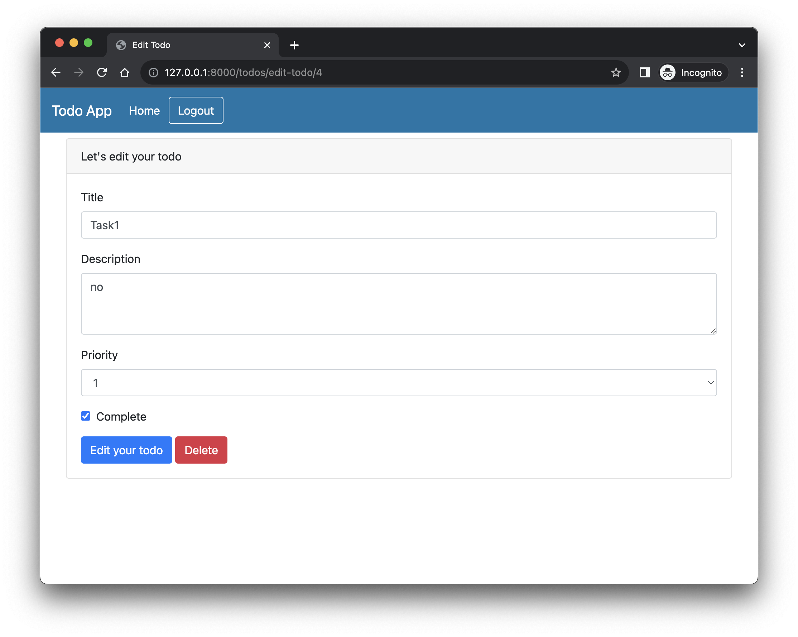
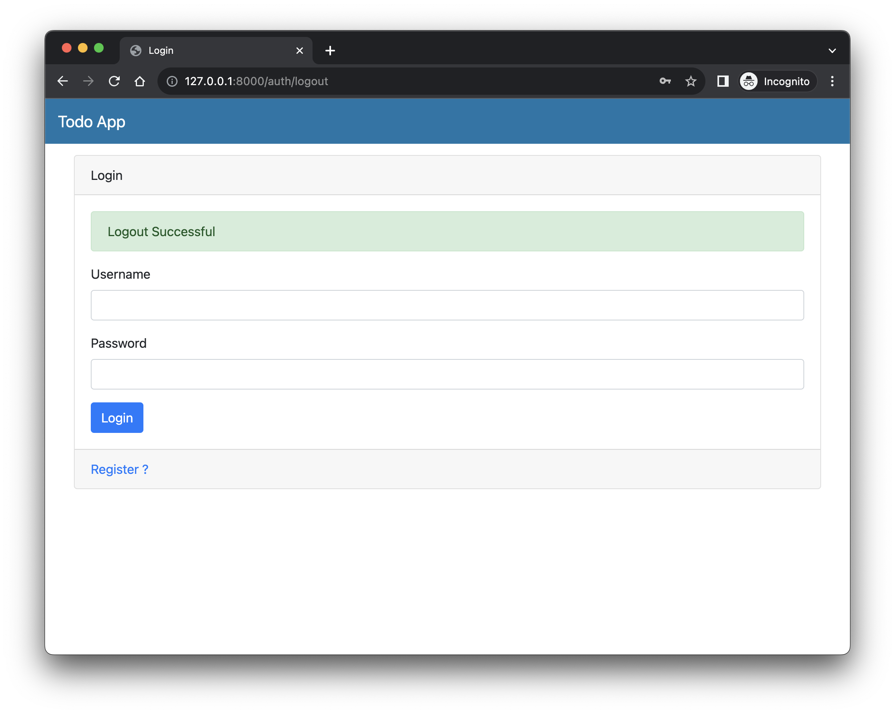
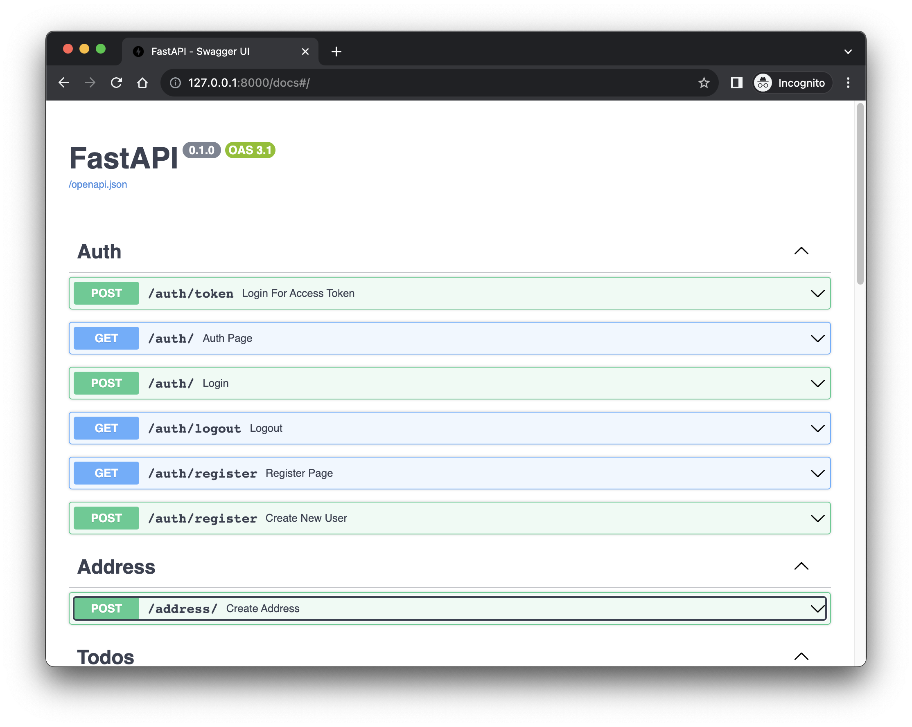
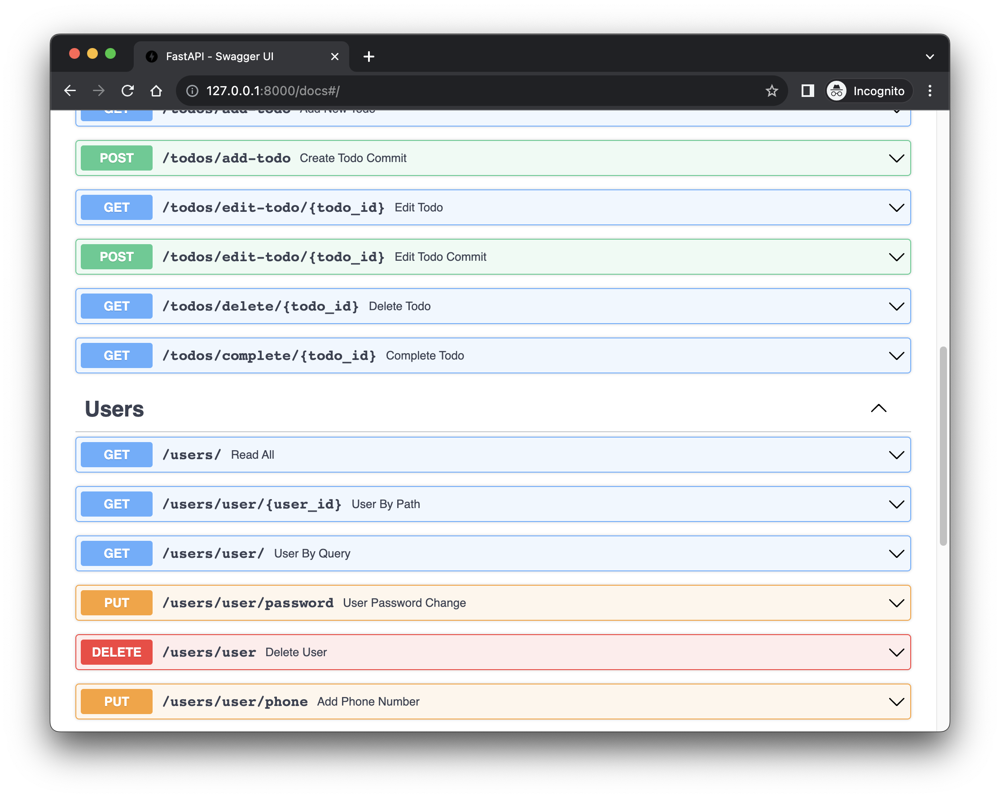

# FastApi Full Stack TODO APP
##### Clone this project
```
git clone https://github.com/gopalkatariya44/fastapi-todo.git
```
##### Adding a package dependency to an app
```
flutter pub get
```

##### Run app
```
flutter run
```

#### login


#### Register


#### Home


#### Edit


#### Logout


#### Auth API


#### Todo API

